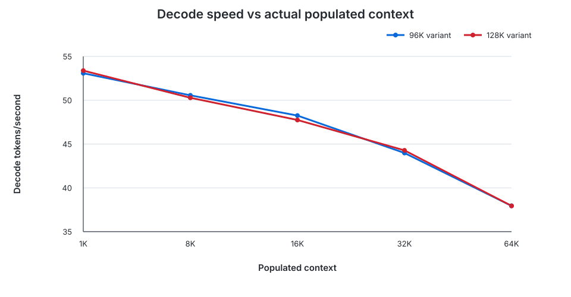
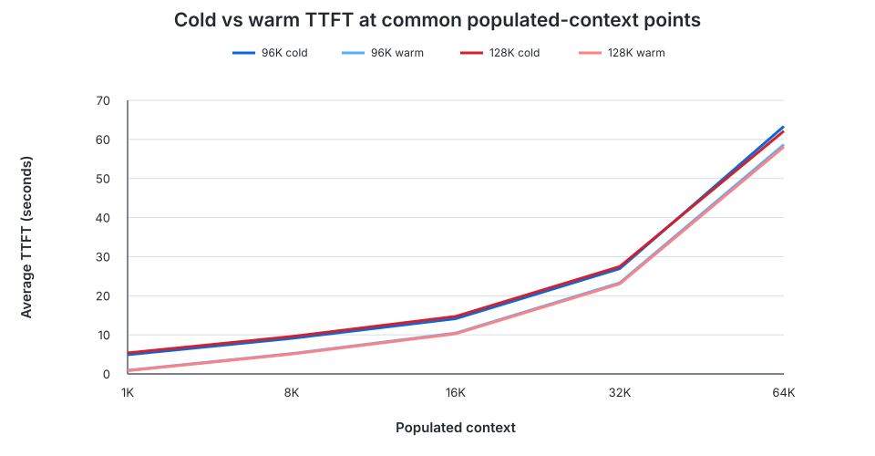

# Qwen3.8-27B IQ3_S on RTX 5070 Ti 16GB

This report summarizes the existing local Ollama measurements for the Qwen3.8-27B IQ3_S context variants. It does not add new benchmark runs. Raw data remains in [Ollama runtime performance](./ollama-runtime-performance.md) and [vocabulary generation A/B](./vocabulary-generation-ab-2026-09-12.md).

Labels used below:

- **Measured** — recorded directly from Ollama, the client wall clock, or `ollama ps`.
- **Derived** — arithmetic calculated from measured values, usually the mean of three runs.
- **Estimated** — a projection recorded in the source benchmark, not direct GPU-use telemetry.
- **Interpretation** — an engineering conclusion, not a measurement.

## Executive Summary

**Measured:** With explicit q4_0 KV cache and Flash Attention, the 48K, 96K, and 128K configurations offloaded all 66/66 layers to the RTX 5070 Ti. Recorded GPU buffer components increased primarily with context size: KV memory was 864 MiB at 48K, 1,728 MiB at 96K, and 2,304 MiB at 128K.

**Derived from measured runs:** Decode speed depended much more on the amount of text actually present in the prompt than on choosing the 96K or 128K model variant. Across their common populated-context points, the two variants stayed within about 1% in the non-streaming measurements. Decode fell from roughly 53 tokens/s near 1K populated tokens to roughly 38 tokens/s near 64K; the 128K variant reached roughly 30 tokens/s near 120K.

**Derived:** Keeping the runner warm greatly reduced time to first token (TTFT) for short prompts. At 1K populated context, average TTFT fell from 4.91 s to 0.92 s for 96K and from 5.38 s to 0.82 s for 128K. At large contexts, prompt processing dominated, so the relative warm-runner benefit shrank to 3.5% at 90K for the 96K model and 1.3% at 120K for the 128K model.

**Interpretation:** Use the 96K variant when the workload fits below its limit and retaining more projected GPU headroom matters. Use the 128K variant when prompts can exceed 96K. Keeping the runner loaded is valuable for interactive short- and medium-context traffic, but it cannot remove the prefill cost of very large prompts.

### Key Results

Configured `num_ctx` is the runner's capacity ceiling; populated context is the number of prompt tokens actually processed. Performance followed populated context, not the capacity label alone.

| Result | 96K variant | 128K variant | Evidence type |
|---|---:|---:|---|
| Configured `num_ctx` | 98,304 | 131,072 | Measured request setting |
| Projected remaining GPU memory | 1,834 MiB | 1,098 MiB | Estimated, not measured |
| Avg decode at ~1K populated context | 53.08 token/s | 53.38 token/s | Derived from measured non-streaming runs |
| Avg decode at ~64K populated context | 37.95 token/s | 37.94 token/s | Derived from measured non-streaming runs |
| Warm avg TTFT at ~1K | 0.92 s | 0.82 s | Derived from measured streaming runs |
| Warm avg TTFT at ~64K | 58.67 s | 58.10 s | Derived from measured streaming runs |
| Largest populated context tested | ~90K | ~120K | Measured |

At common 1K–64K populated-context points, neither variant demonstrated a material performance advantage. The practical distinction is capacity and projected GPU headroom: 96K is the default fit when it is large enough; 128K exists for workloads that need the extra context.

## Test Environment

| Item | Recorded value | Status |
|---|---|---|
| GPU | NVIDIA RTX 5070 Ti, 16GB | Measured environment description |
| Model family | Qwen3.8-27B, 27.3B parameters, IQ3_S model quantization | Measured model metadata |
| Runtime endpoint | Ollama at `http://192.168.0.100:11435` for performance tests | Measured configuration |
| Runtime variants | `qwen38-27b-iq3s-96k`, `qwen38-27b-iq3s-128k` | Measured |
| Thinking | Explicitly disabled with `think:false` | Measured request configuration |
| Streaming generation | `stream:true`, `temperature:0`, `seed:0`, `num_predict:64` | Measured request configuration |
| Cold lifecycle | `keep_alive:0`; runner unloaded after each request | Measured request configuration |
| Warm lifecycle | One warm-up, `/api/ps` load confirmation, then `keep_alive:30m` | Measured procedure |

Terms used in this report:

- **Configured `num_ctx`** is the maximum context capacity requested from Ollama for a model invocation. It is not proof that every request contains that many tokens.
- **Populated context** is the text actually present in the request, reported by Ollama as `prompt_eval_count`. For example, a 128K-capable runner can process a prompt containing only about 1K tokens.
- **TTFT (time to first token)** is client wall-clock time from starting the HTTP request until the first streamed chunk containing non-empty generated text. Empty and metadata-only chunks do not count.
- A **cold request** starts with the runner unloaded and therefore includes model/runner loading work.
- A **warm request** is sent after a warm-up while `/api/ps` confirms the runner remains loaded.

Ollama version, host CPU, driver version, power state, clock state, and ambient temperature were not recorded.

## GPU Memory / Context Capacity

### Original/default Ollama observations

`OLLAMA_KV_CACHE_TYPE` was unset, so these runs used the default f16 KV cache. Flash Attention was left at default/automatic behavior and was not confirmed. `ollama ps PROCESSOR` is reproduced as observed; it is not a layer-offload percentage.

| Configured context | `ollama ps SIZE` | `ollama ps PROCESSOR` | Status |
|---:|---:|---|---|
| 4K | ~11 GB | 100% GPU | Measured, approximate size |
| 40K | ~14 GB | 100% GPU | Measured, approximate size |
| 48K | ~15 GB | 6%/94% CPU/GPU | Measured, approximate size |
| 64K | ~16 GB | 14%/86% CPU/GPU | Measured, approximate size |
| 96K | ~18 GB | 24%/76% CPU/GPU | Measured, approximate size |

### Explicit q4_0 KV + Flash Attention

| `num_ctx` | Model GPU | KV GPU | Recurrent state | Compute | GPU layers | Projected GPU use | Projected remaining |
|---:|---:|---:|---:|---:|---:|---:|---:|
| 49,152 | 10,616.86 MiB | 864.00 MiB | 149.63 MiB | 320.28 MiB | 66/66 | 11,950 MiB | Not recorded |
| 98,304 | 10,616.86 MiB | 1,728.00 MiB | 149.63 MiB | 560.28 MiB | 66/66 | 13,054 MiB | 1,834 MiB |
| 131,072 | 10,616.86 MiB | 2,304.00 MiB | 149.63 MiB | 720.28 MiB | 66/66 | 13,790 MiB | 1,098 MiB |

Model, KV, recurrent-state, compute buffers, and 66/66 layer status are **measured** from verified runner logs. “Projected GPU use” and “projected remaining” are **estimates**. The 128K estimate leaves only 74 MiB above Ollama's recorded 1,024 MiB fit-reserve threshold.

## Decode Performance vs Actual Populated Context

These are **derived means of three measured non-streaming requests** per point. Each request used explicit model `num_ctx`, deterministic filler, `think:false`, `temperature:0`, `seed:0`, `num_predict:64`, and `keep_alive:0`. Actual output counts sometimes ended below 64 when the model stopped early.

The chart uses the five populated-context points shared by both variants. Lines are listed in order as 96K, then 128K; their near-overlap is the result. Larger actual contexts reduce decode throughput regardless of whether the runner was configured for 96K or 128K.

Chart series: **96K variant**, **128K variant**. Values are derived three-run means from the detailed table below.

| Target populated context | Actual prompt tokens, 96K | 96K avg decode | Actual prompt tokens, 128K | 128K avg decode |
|---:|---:|---:|---:|---:|
| 1K | 1,027–1,028 | 53.08 token/s | 1,027–1,028 | 53.38 token/s |
| 8K | 8,195–8,196 | 50.56 token/s | 8,195–8,196 | 50.28 token/s |
| 16K | 16,388–16,389 | 48.25 token/s | 16,388–16,389 | 47.78 token/s |
| 32K | 32,772–32,773 | 43.98 token/s | 32,772–32,773 | 44.24 token/s |
| 64K | 65,540–65,541 | 37.95 token/s | 65,540–65,541 | 37.94 token/s |
| 80K | 81,924–81,925 | 35.37 token/s | — | — |
| 90K | 92,164–92,165 | 33.91 token/s | — | — |
| 96K | — | — | 98,308–98,309 | 32.89 token/s |
| 120K | — | — | 122,885–122,886 | 30.02 token/s |

**Interpretation:** The monotonic decline is consistent with a larger populated KV cache increasing per-token attention work. This experiment establishes correlation for this setup; it does not isolate a single hardware or kernel-level cause.

## Cold vs Warm TTFT

The tables below show **derived averages of three measured streaming runs**. TTFT includes LAN HTTP overhead. Cold TTFT also includes runner loading; warm TTFT follows a warm-up and `/api/ps` confirmation. The deterministic marker differed between cold and warm experiments, producing a small difference in actual prompt counts.

TTFT rises strongly with actual populated context. Warming removes a mostly fixed loading cost, so it matters most on short prompts and becomes a smaller fraction of total latency as prompt prefill grows.

Chart series in order: **96K cold**, **96K warm**, **128K cold**, **128K warm**. Values are derived three-run means; detailed tables follow.

### 96K model

| Populated context | Cold avg TTFT | Warm avg TTFT | Reduction | Relative reduction |
|---:|---:|---:|---:|---:|
| 1K | 4.91 s | 0.92 s | 3.99 s | 81.29% |
| 8K | 9.10 s | 5.21 s | 3.89 s | 42.73% |
| 16K | 14.14 s | 10.46 s | 3.68 s | 26.05% |
| 32K | 26.94 s | 23.31 s | 3.63 s | 13.48% |
| 64K | 63.34 s | 58.67 s | 4.68 s | 7.38% |
| 80K | 86.09 s | 81.02 s | 5.07 s | 5.88% |
| 90K | 99.25 s | 95.76 s | 3.50 s | 3.52% |

### 128K model

| Populated context | Cold avg TTFT | Warm avg TTFT | Reduction | Relative reduction |
|---:|---:|---:|---:|---:|
| 1K | 5.38 s | 0.82 s | 4.55 s | 84.74% |
| 8K | 9.58 s | 5.08 s | 4.50 s | 46.99% |
| 16K | 14.72 s | 10.28 s | 4.44 s | 30.15% |
| 32K | 27.48 s | 23.05 s | 4.43 s | 16.12% |
| 64K | 62.14 s | 58.10 s | 4.04 s | 6.50% |
| 96K | 107.94 s | 105.78 s | 2.16 s | 2.00% |
| 120K | 149.72 s | 147.78 s | 1.93 s | 1.29% |

**Interpretation:** Warming removes most cold-start cost, which dominates short prompts. As the populated context grows, prefill becomes the dominant part of TTFT, so the percentage saved by warming declines.

## 96K vs 128K Comparison

### Common populated-context points, warm streaming

These values are **derived means of three measured warm requests**.

| Populated context | 96K avg TTFT | 128K avg TTFT | 96K avg decode | 128K avg decode |
|---:|---:|---:|---:|---:|
| 1K | 0.92 s | 0.82 s | 44.03 token/s | 53.38 token/s |
| 8K | 5.21 s | 5.08 s | 49.40 token/s | 51.05 token/s |
| 16K | 10.46 s | 10.28 s | 47.75 token/s | 49.01 token/s |
| 32K | 23.31 s | 23.05 s | 44.66 token/s | 44.83 token/s |
| 64K | 58.67 s | 58.10 s | 37.97 token/s | 38.22 token/s |

The 96K 1K decode mean includes one measured 34.55 token/s run; its other two runs were 48.84 and 48.68 token/s. With only three samples, that mean should not be generalized.

For the non-streaming common-point experiment, the measured mean decode-rate differences between the variants ranged from −0.60% to +0.98%. **Interpretation:** no material decode-speed advantage for either configured context variant was demonstrated at 1K–64K populated context.

## Practical Recommendation

The following statements are **interpretations**, not additional measurements:

- Prefer the 96K q4_0/Flash Attention variant for workloads that reliably stay below its context limit. It had 1,834 MiB of projected remaining GPU memory versus 1,098 MiB for 128K, while common-point decode and warm TTFT were broadly similar.
- Choose the 128K variant when the application must accept prompts beyond 96K. It completed the measured 120K populated-context workload with all 66/66 layers offloaded, at about 30 token/s decode and 147.78 s average warm TTFT.
- Keep the selected runner warm for latency-sensitive service traffic. The improvement is largest for short requests; do not expect warming to make a 90K–120K prefill interactive.
- Budget latency using actual populated context, not only configured `num_ctx`. A large-capacity model with a short prompt decoded near 53 token/s, while the same 128K variant near 120K populated tokens decoded near 30 token/s.
- Treat the 128K memory configuration as close to the recorded fit threshold. The remaining 1,098 MiB is estimated, and only 74 MiB exceeds Ollama's 1,024 MiB reserve threshold.

## Methodology and Limitations

- Requests used the Ollama HTTP API directly. Thinking was explicitly disabled.
- Populated-context prompts used deterministic repeated filler. A distinct leading marker was used for each iteration to avoid prompt-cache reuse.
- Cold runs used `keep_alive:0`; warm runs used `keep_alive:30m`, one warm-up per model, and `/api/ps` confirmation before measurement.
- Each populated-context point has three completed measurements. No partial response was included: the client required non-empty generated text, a final metadata chunk, and numeric timing/count fields.
- The requested 64-token completion was a maximum. Ollama sometimes reported fewer output tokens because generation stopped early.
- Prompt content was synthetic and repetitive. Results may differ for natural language, code, retrieval-augmented prompts, or mixed media.
- Three samples per point are enough to expose broad trends but not to characterize tail latency or statistical variance.
- Cold and warm prompt markers have slightly different tokenization, so their actual prompt counts differ by several tokens.
- TTFT was measured at the benchmark client across a LAN, not inside the Ollama process.
- Buffer sizes and 66/66 layer status came from verified runner logs. Projected GPU use and remaining memory are estimates and are not presented as measurements.
- The original default/f16 `ollama ps` SIZE values were approximate observations. `PROCESSOR` percentages must not be interpreted as layer-offload percentages.
- No writing-quality, correctness, power-consumption, thermal, or concurrency benchmark was performed.
